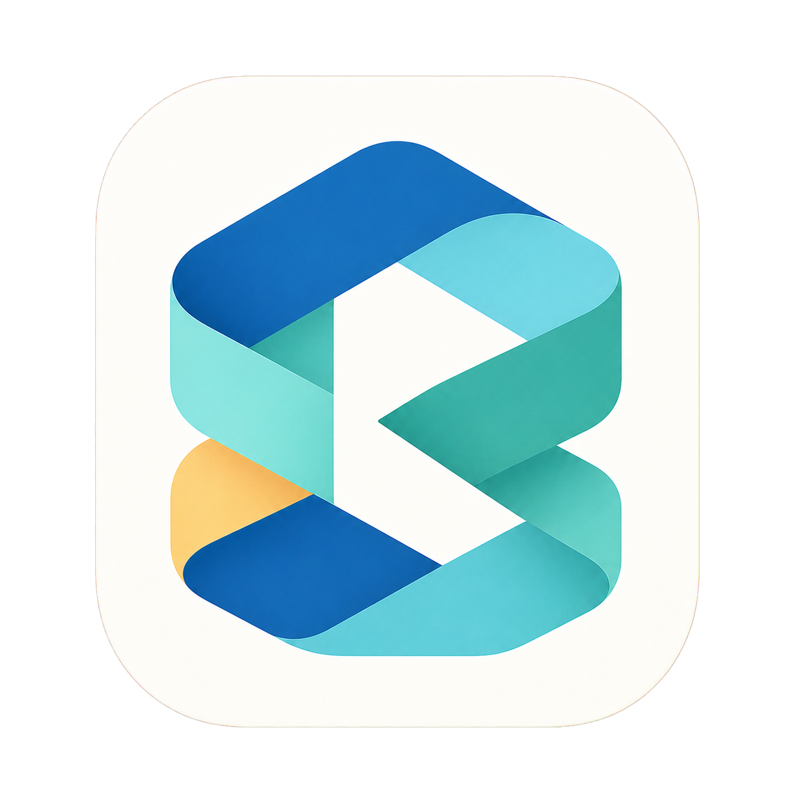
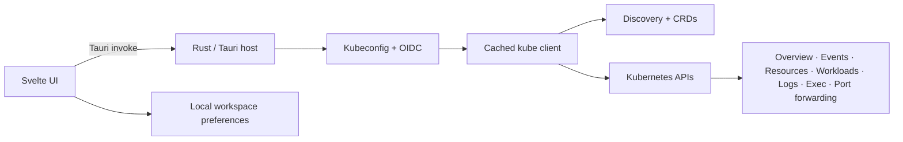

  

<h1 align="center">Kuberniva</h1>

  <strong>Kubernetes, in focus.</strong> 
  A fast, native desktop workspace for people who operate many Kubernetes clusters.

  
  
  
  
  

Kuberniva is an open-source, local-first Kubernetes desktop app. It keeps cluster switching quick and puts the information that matters—health, workloads, resources, events, logs, and safe operations—into one focused workspace.

## ✨ Highlights

| | What you can do |
| --- | --- |
| 🗂️ **Clusters** | Add kubeconfig files or folders, merge contexts, switch clusters from the top selector, and connect lazily only when a cluster is opened. |
| 🔐 **Authentication** | Use OIDC `exec`, OIDC auth-provider, bearer-token, and client-certificate kubeconfigs. |
| ⭐ **Shortcuts** | Pin up to 10 clusters, rename their shortcuts, and keep them across restarts. |
| 📊 **Overview** | See workloads, resources, node readiness, full node details, and live CPU/memory usage when Metrics API is available. |
| 🛎️ **Events** | Browse recent Kubernetes Events with warning/normal filters and search. |
| 🧭 **Resources** | Discover built-in APIs and CRDs, browse namespaced or cluster-scoped objects, and inspect metadata, labels, owners, ports, and properties. |
| 📝 **Editors** | Edit ConfigMaps and Secrets as key/value data, reveal Secret values from base64 on demand, edit YAML, save, and view certificate expiry. |
| 🚀 **Workloads** | Inspect Deployments, StatefulSets, DaemonSets, ReplicaSets, Jobs, CronJobs, Pods, and other discovered workload types. |
| 📜 **Operations** | View sibling-pod logs, select containers, refresh every 30 seconds, preserve scroll position, open a Pod terminal, and start/stop port forwards. |
| 🎨 **Workspace** | Use a full-window, light ivory/golden interface with a collapsible sidebar, persistent cluster context, loading states, confirmations, and actionable notifications. |

## 🏗️ Architecture

Kuberniva has two small layers:

- **Svelte 5 + TypeScript:** renders the workspace and owns navigation, selection, editors, sessions, and local preferences.
- **Tauri 2 + Rust:** parses kubeconfigs, runs OIDC authentication, discovers APIs and CRDs, talks to Kubernetes, reads logs, executes commands, and manages port forwarding.

Kuberniva reads kubeconfig metadata locally, then creates and caches a Kubernetes client only for the selected context. Cluster sessions, selected namespaces, sidebar state, and favorite shortcut names are restored locally. No proxy service is required.

## 🚀 Run from source

Requirements: Node.js, npm, Rust, and macOS for the native desktop build.

~~~bash
npm install
npm run tauri dev
~~~

For a browser-only UI preview:

~~~bash
npm run dev
~~~

Live Kubernetes connections, OIDC execution, logs, terminal access, and port forwarding require the Tauri desktop host.

## 📦 Build and install locally

Build the Apple Silicon app bundle:

~~~bash
npm run tauri build -- --bundles app
~~~

The bundle is created at `src-tauri/target/release/bundle/macos/Kuberniva.app`. Copy it to the other Mac's `/Applications` folder.

 macOS says the local app is damaged or from an unidentified developer?

For an ad-hoc local build, remove the quarantine attribute and open the app:

~~~bash
xattr -cr /Applications/Kuberniva.app
open /Applications/Kuberniva.app
~~~

Developer ID signing and notarization are required for a public distribution that opens without this first-launch step. Each user adds their own kubeconfig sources after installation.

## 🧪 Checks

~~~bash
npm run check
npm run build
cargo test --manifest-path src-tauri/Cargo.toml
~~~

## 📁 Repository layout

~~~text
public/                 # Logo and static assets
src/App.svelte          # Main Svelte workspace
src/app.css             # UI and responsive design system
src-tauri/src/lib.rs    # Rust/Tauri and Kubernetes integration
src-tauri/icons/        # Native app icons
LICENSE                 # MIT license
~~~

## License

Kuberniva is released under the [MIT License](LICENSE).
